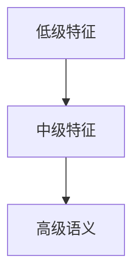
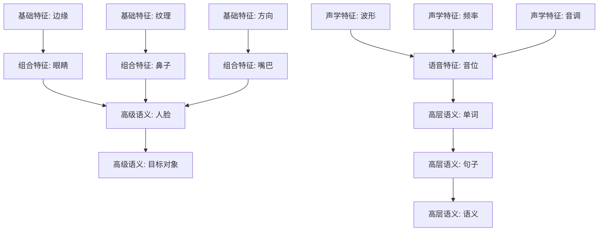

---
tags:
  - 理论
  - 深度学习
date: 2026-05-25
---

# 一、深层神经网络的基本结构

## 1.从 Logistic Regression 到 Deep Network

逻辑回归本质上可以视为一个单层神经网络：

$\hat y=\sigma(w^Tx+b)$

```text
输入层 → 隐藏层 → 输出层
```

则得到两层神经网络（不计输入层）

## 2.深层网络中的核心变量

- 输入维度：$n^{[0]}=n_x$
- 第 (l) 层神经元数量：$n^{[l]}$

1. 激活值

- 第 (l) 层激活值：$a^{[l]}$
	
- 向量化形式：$A^{[l]}$
	
- 输入满足：$a^{[0]}=x$
	
- 输出满足：$a^{[L]}=\hat y$

2. 线性部分

- $z^{[l]}=W^{[l]}a^{[l-1]}+b^{[l]}$
	
- 其中：
	
	- $W^{[l]}$：权重矩阵
    
	- $b^{[l]}$：偏置向量
    

3. 激活函数

- $a^{[l]}=g^{[l]}(z^{[l]})$
	
- 常见激活函数：(非线性变换)
	
| 函数      | 表达式                            | 特点         |
| ------- | ------------------------------ | ---------- |
| Sigmoid | $(\sigma(z)=\frac1{1+e^{-z}})$ | 二分类输出      |
| ReLU    | $(\max(0,z))$                  | 训练快，缓解梯度消失 |
| Tanh    | $(\tanh(z))$                   | 零中心        |

---

# 二、前向传播

## 1.向量化前向传播

对于 $m$ 个样本：

$$  
Z^{[l]}=W^{[l]}A^{[l-1]}+b^{[l]}  
$$

$$  
A^{[l]}=g^{[l]}(Z^{[l]})  
$$

初始化：

$$  
A^{[0]}=X  
$$

这里：

- 每一列对应一个样本
    
- 每一行对应一个特征
    

因此：

- 矩阵一次处理整个Batch
	
- 而不是：for循环一个一个算

## 2.前向传播的本质

深层网络表达能力来源于： ==**多层线性组合 + 多次非线性嵌套**==

即：

$$  
x  
\rightarrow  
W_1x+b_1  
\rightarrow  
g_1(\cdot)  
\rightarrow  
W_2(\cdot)+b_2  
\rightarrow  
g_2(\cdot)  
\rightarrow \cdots  
$$

---

# 三、反向传播

## 1.反向传播目标

目标：

$$  
\frac{\partial J}{\partial W^{[l]}},  
\quad  
\frac{\partial J}{\partial b^{[l]}}  
$$

然后利用梯度下降更新：
$$  
W^{[l]}  
\leftarrow  
W^{[l]}-\alpha dW^{[l]}  
$$
$$  
b^{[l]}  
\leftarrow  
b^{[l]}-\alpha db^{[l]}  
$$

其中：

- $\alpha$：学习率

## 2.链式法则

即：
$$  
\frac{dJ}{dx}
\frac{dJ}{dy}  
\frac{dy}{dx}  
$$
- 本质上：后面的误差决定前面的参数怎么改

## 3.单层反向传播

1. 计算 $dz^{[l]}$

- 由：$a^{[l]}=g^{[l]}(z^{[l]})$
	
- 得到：
$$  
dz^{[l]}
=
da^{[l]}  
*  
g'^{[l]}(z^{[l]})  
$$

2. 计算权重梯度 
$$  
dW^{[l]}
=
dz^{[l]}a^{[l-1]T}  
$$
- 含义：当前层误差  ×  上一层激活值

3. 计算偏置梯度
$$  
db^{[l]}=dz^{[l]}  
$$

因为：
$$  
\frac{\partial z}{\partial b}=1  
$$

4. 传播到前一层
 $$  
da^{[l-1]}
=
W^{[l]T}dz^{[l]}  
$$

## 4.向量化反向传播

对于 Batch Size 为 $m$：

1. 计算 $dZ^{[l]}$ 
$$  
dZ^{[l]}
=
dA^{[l]}  
*  
g'^{[l]}(Z^{[l]})  
$$
2. 计算权重梯度
$$  
dW^{[l]}
=
\frac1m  
dZ^{[l]}A^{[l-1]T}  
$$
3. 计算偏置梯度
$$  
db^{[l]}
=
\frac1m  
\sum_{i=1}^{m}  
dZ_i^{[l]}  
$$
4. 传播梯度
$$  
dA^{[l-1]}
=
W^{[l]T}dZ^{[l]}  
$$

## 5.反向传播的本质

- 利用计算图高效求导

---

# 四、矩阵维度

## 1.参数维度

1. 输入矩阵

$$  
X=A^{[0]}  
\in  
\mathbb R^{n_x\times m}  
$$
2. 激活矩阵

$$  
A^{[l]}  
\in  
\mathbb R^{n^{[l]}\times m}  
$$
3. 线性矩阵

$$  
Z^{[l]}  
\in  
\mathbb R^{n^{[l]}\times m}  
$$
## 2.梯度维度

- 必须满足：
$$  
dW^{[l]}  
\text{ 与 }  
W^{[l]}  
\text{ 维度相同且}  

db^{[l]}  
\text{ 与 }  
b^{[l]}  
\text{ 维度相同}  
$$

- 参数更新必须一一对应


# 五、为什么深层网络有效

## 1.层次化特征学习

深层网络核心思想：


## 2.图像识别示例 



## 3.深层网络的理论优势

- 深层网络仅需：

$$  
O(\log n)  
$$
- 浅层网络可能需要：$O(2^n)$

即：

```text
深度
可以指数级降低表示复杂度
```


## 4.XOR 示例

目标函数：

$$  
x_1\oplus x_2\oplus\cdots\oplus x_n  
$$

深层结构：

```text
树状递归 XOR
```

例如：

```text
(x1 XOR x2)
      XOR
(x3 XOR x4)
```

复杂度较低。

若只允许单隐藏层：

```text
需要枚举大量输入组合
```

导致：

```text
隐藏单元指数爆炸
```

这也是为什么：

```text
“更深”
不只是“更多层”
```

而是：

```text
更高效的函数表达结构
```

---

# 六、深度网络的模块化结构

## Step 1：初始化参数

随机初始化：

$$  
W,b  
$$

## Step 2：前向传播

计算预测值：

$$  
\hat y  
$$


## Step 3：计算损失

例如交叉熵：

 $$  
J

-\frac1m  
\sum  
\left[  
y\log\hat y  
+  
(1-y)\log(1-\hat y)  
\right]  
$$


## Step 4：反向传播

得到：

$$  
dW,\quad db  
$$

## Step 5：梯度下降更新

$$  
W\leftarrow W-\alpha dW  
$$

## Step 6：重复迭代

直到收敛

整个训练过程本质：

```text
随机猜参数
→
计算错误
→
沿梯度调整
→
重复上亿次
```

## 关联

- 上位：[[00 System/MOCs/MOC-深度学习与实现]]
- 前置：[[1.2浅层神经网络]]
- 后续：[[03 Resources/计算智能/深度学习/2.神经网络优化/2.1深层神经网络的训练诊断与正则化]]
