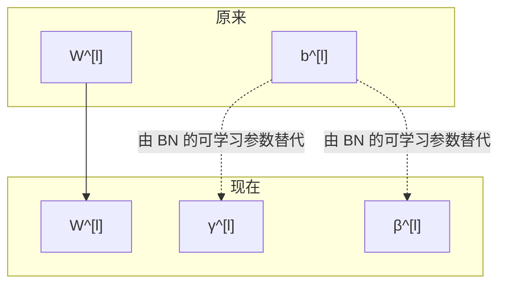

---
tags:
  - 理论
  - 深度学习
date: 2026-06-01
---

---

# 〇、本周主线

- **目标**：让神经网络更容易调、训练更稳定、实现更高效。
- **核心内容**：超参数搜索、Batch Norm、Softmax、多分类训练、深度学习框架。
- **整体逻辑**：
  - 先解决“超参数怎么找”
  - 再解决“训练为什么不稳、怎么稳定”
  - 最后解决“多分类怎么做、工程上怎么实现”

---

# 一、超参数调试

## 1. 优先级

> [!tip] 最重要
> 学习率 $\alpha$

> [!important] 第二梯队
> - Momentum 的 $\beta$
> - mini-batch size
> - 隐藏层单元数

> [!note] 第三梯队
> - 层数 $L$
> - 学习率衰减
> - 其他结构细节

> [!warning] 通常不太调
> - Adam 的 $\beta_1 = 0.9$
> - Adam 的 $\beta_2 = 0.999$
> - $\varepsilon = 10^{-8}$

## 2. 搜索策略

### （1）随机搜索优于网格搜索

- 很难提前知道哪个超参数最重要
- 随机搜索能覆盖更多潜在有效值
- 如果只有少数超参数真正关键，随机搜索更高效

### （2）由粗到细

1. 先在大范围内粗搜
2. 找到效果好的局部区域
3. 在这个小范围内更密集搜索

---

# 二、如何给超参数选范围

## 1. 线性取值 vs 对数取值

### （1）适合线性取值的情况

- 隐藏单元数 $n^{[l]} \in [50,100]$
- 网络层数$L \in \{2,3,4\}$
- 一些离散结构参数

### （2）适合对数取值的情况

- 跨多个数量级变化的参数，不能在线性轴上均匀采样。
- 如学习率 可能范围是 $[10^{-4},1]$

- 步骤
	1. 先对指数采样
	2. 再映射回原参数
	
例如：

- 若 $\alpha \in [10^{-4},10^0]$
- 就令 $r \in [-4,0]$
- 然后取 $\alpha = 10^r$

## 2. 对 $\beta$ 的取值方法

例如：

- 若 $\beta \in [0.9,0.999]$
- 则 $1-\beta \in [10^{-1},10^{-3}]$

做法：

$$
\beta = 1 - 10^r
$$
$$
r \in [-3,-1]
$$

---

# 三、Batch Norm（Batch Normalization）

## 1. 位置

$$
z^{[l]} \rightarrow \text{BatchNorm} \rightarrow \tilde z^{[l]} \rightarrow a^{[l]} = g(\tilde z^{[l]})
$$
## 2. 单层 Batch Norm 的流程

对某层的 mini-batch 中间变量 $z^{(1)}, z^{(2)}, \dots, z^{(m)}$：

1. 求均值
	
$$
\mu = \frac{1}{m}\sum_{i=1}^{m} z^{(i)}
$$

2. 求方差
	
$$
\sigma^2 = \frac{1}{m}\sum_{i=1}^{m}(z^{(i)}-\mu)^2
$$

3. 标准化
	
$$
z_{\text{norm}}^{(i)}=\frac{z^{(i)}-\mu}{\sqrt{\sigma^2+\varepsilon}}
$$

4. 缩放和平移
	
$$
\tilde z^{(i)}=\gamma z_{\text{norm}}^{(i)}+\beta
$$
	
	- $\gamma$：控制缩放
	- $\beta$：控制平移

## 3.  $\gamma$ 与 $\beta$作用

- 原：强制均值 0方差 1但这未必是最优分布。

- 加入 $\gamma$ 和 $\beta$ 后：
	
	- 网络可以自己学出更合适的均值和方差
	- 标准化不会过度限制表达能力

## 4. 多层网络中的结构

## 5. 为什么可以去掉 $b^{[l]}$

$z^{[l]} - \mu$  会把线性层里统一加上的偏置抵消掉。

- $b^{[l]}$ 可以省略
- 偏移作用交给 $\beta^{[l]}$

---

# 四、Batch Norm 原理

## 1. 第一层理解：像输入归一化一样加快训练

和输入归一化类似：

- 输入特征做归一化后，优化更容易
- 隐藏层中间值归一化后，后续层也更容易训练

## 2. 第二层理解：减轻内部协变量偏移

前层参数一变，后层输入分布也会跟着变。

这会导致：

- 后层一直在适应前层分布变化
- 学习变慢

Batch Norm 的作用是：

- 让每层看到的输入分布更稳定
- 减弱前层参数变化对后层的冲击

所以后层学习更轻松，整体训练更快。

## 3. 轻微正则化副作用

Batch Norm 在 mini-batch 上计算均值和方差，而不是在全量数据上精确计算。

因此：

- 均值和方差本身带一些噪声
- 归一化过程也会引入一点噪声

效果有点像：

- 给隐藏层加了轻微扰动
- 所以会带来一点正则化效果

但要注意：

- **Batch Norm 的主要目的不是正则化**
- 正则化只是副作用

---

# 五、测试时的 Batch Norm

## 1. 问题

训练时，Batch Norm 依赖当前 mini-batch 的均值和方差：

- $\mu$
- $\sigma^2$

但测试时：

- 可能一次只输入一个样本
- 没法在单个样本上算 mini-batch 统计量

## 2. 解决办法

训练时持续估计每层的：

- 均值的滑动平均
- 方差的滑动平均

$$
z_{\text{norm}}=\frac{z-\mu_{\text{running}}}{\sqrt{\sigma^2_{\text{running}}+\varepsilon}}
$$

然后再做：

$$
\tilde z = \gamma z_{\text{norm}}+\beta
$$

## 3. 工程结论

- 训练时：用 mini-batch 的统计量
- 测试时：用训练过程中积累的全局估计统计量

---

# 六、Softmax 回归

## 1. 解决什么问题

- 多分类问题
- 输出属于每个类别的概率

## 2. 输出结构

$$
\hat y = a^{[L]}
$$

是一个 $C \times 1$ 向量，每个元素表示对应类别的概率，做到放大数据且满足：

$$
\sum_{i=1}^{C}\hat y_i = 1
$$

## 3. Softmax 的计算

$$
z^{[L]} = W^{[L]}a^{[L-1]} + b^{[L]}
$$

$$
a_i^{[L]}=\frac{e^{z_i^{[L]}}}{\sum_{j=1}^{C}e^{z_j^{[L]}}}
$$

## 4. 损失函数

- Softmax 常用交叉熵损失：
$$
L(\hat y,y)=-\sum_{j=1}^{C} y_j \log \hat y_j
$$
$$
J=\frac{1}{m}\sum_{i=1}^{m}L(\hat y^{(i)},y^{(i)}) = -\frac{1}{m}\sum_{i=1}^{m}\sum_{j=1}^{C} y_j \log \hat y_j
$$

## 5. 反向传播的关键公式

Softmax + 交叉熵 输出层求导用于反向传播

$$
dz^{[L]} = \hat y - y
$$

---

# 十二、一页总结

| 模块               | 核心作用       | 关键结论               |
| ---------------- | ---------- | ------------------ |
| 超参数调试            | 找到更有效的训练配置 | 随机搜索 + 由粗到细更实用     |
| 合理取值范围           | 提高搜索效率     | 学习率、$\beta$ 适合对数尺度 |
| Pandas vs Caviar | 组织搜索流程     | 算力少盯单模型，算力多并行跑     |
| Batch Norm       | 稳定训练、加速收敛  | 放在线性层后、激活前         |
| Batch Norm 测试    | 保证推理可用     | 测试时用运行均值和方差        |
| Softmax          | 多分类输出概率    | 是 Logistic 回归的多类推广 |
| 交叉熵损失            | 训练 Softmax | 核心目标是拉高正确类概率       |
| 深度学习框架           | 提升实现效率     | 工程中要依赖框架           |
| TensorFlow       | 框架示例       | 定义变量、损失、优化器、运行     |

---

# 十三、复习抓手

- **超参数搜索**：随机搜索通常比网格搜索更适合深度学习。
- **学习率取值**：跨数量级参数优先在对数尺度上采样。
- **Batch Norm**：本质是稳定隐藏层分布，让后层更容易学。
- **Batch Norm 测试阶段**：不能再用当前样本自己算均值方差。
- **Softmax**：输出是概率向量，总和为 1。
- **Softmax 损失**：就是多分类交叉熵。
- **深度学习框架**：理解原理后，应尽快依赖框架提高效率。
`