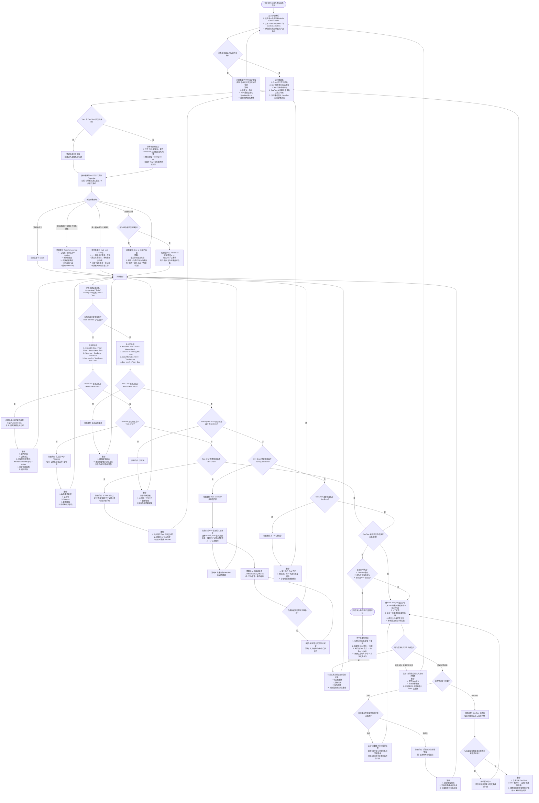

---
tags:
  - 理论
  - 深度学习
date: 2026-06-02
---

## 关联

- 上位：[[00 System/MOCs/MOC-深度学习与实现]]
- 前置：[[3.1指标设计、数据集划分和误差判断]] 与 [[3.2误差分析、分布不匹配与迁移学习]]
- 后续：[[03 Resources/计算智能/深度学习/4.卷积神经网络/4.1卷积神经网络基础：卷积、池化与 CNN 结构入门]]
