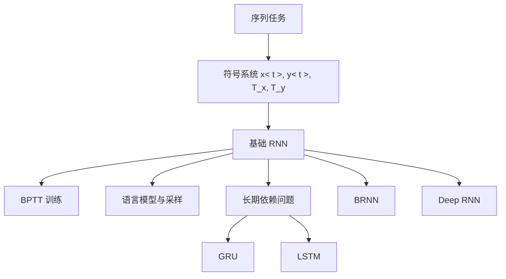

---
tags:
  - 理论
  - 深度学习
date: 2026-06-06
---

# 一、宏观认识

## 1. 序列模型在解决什么问题

序列模型处理的是“输入、输出或两者都带有顺序结构”的任务。核心不是单个样本点，而是元素之间的前后依赖。

典型任务包括：

- 语音识别：音频序列 $\rightarrow$ 文本序列
- 音乐生成：空输入或单个条件 $\rightarrow$ 音符序列
- 情感分类：文本序列 $\rightarrow$ 单个标签
- DNA 分析：碱基序列 $\rightarrow$ 功能/片段标注
- 机器翻译：源语言序列 $\rightarrow$ 目标语言序列
- 视频行为识别：视频帧序列 $\rightarrow$ 行为标签
- 命名实体识别：单词序列 $\rightarrow$ 每个位置的实体标记

## 2. 为什么不能直接用普通神经网络

普通全连接网络不适合序列任务，主要有两点：

- 序列长度可变，$T_x$、$T_y$ 不一定固定
- 不同位置之间无法自然共享“同一种模式”的知识

对序列来说，模型应具备两种能力：

- 能处理不同长度输入/输出
- 能把“在位置 1 学到的规律”推广到位置 $t$

## 3. 本周内容主线

这一周的主线可以概括为：

1. 用统一符号描述序列问题
2. 从基本 RNN 建立序列到序列映射
3. 理解 BPTT 与语言模型训练
4. 看到基础 RNN 的长期依赖缺陷
5. 用 GRU / LSTM / BRNN / Deep RNN 增强表达能力

上图表示本周不是零散堆模型，而是从“基础 RNN 的能力与缺陷”逐步演化出后续改进。

---

# 二、基础表示与 RNN 主体

## 1. 序列的基本符号

用 $x^{<t>}$ 表示输入序列第 $t$ 个位置，用 $y^{<t>}$ 表示输出序列第 $t$ 个位置。

关键记号：

- $T_x$：输入序列长度
- $T_y$：输出序列长度
- $x^{(i)<t>}$：第 $i$ 个样本的第 $t$ 个输入
- $T_x^{(i)}$：第 $i$ 个样本的输入长度

序列任务的重要特点是：不同样本的 $T_x^{(i)}$、$T_y^{(i)}$ 可以不同。

## 2. 单词如何表示

课程里先采用词表（vocabulary）+ one-hot 编码。

处理流程：

- 先建立词典
- 每个词映射为词典中的一个位置
- 用 one-hot 向量表示该词
- 对词表外单词，用 `<UNK>` 表示

这套表示很直接，但也带来两个代价：

- 输入维度很高
- 词表外词会被统一压到 `<UNK>`

## 3. 基础 RNN 的前向传播

![[2face78e-5537-4998-bcb2-a2822e5b9bc1 1.png]]

基础 RNN 在每个时间步使用“当前输入 + 上一时刻状态”计算当前状态，再输出预测。

核心公式：

$$
a^{<t>} = g_1(W_{aa}a^{<t-1>} + W_{ax}x^{<t>} + b_a)
$$

$$
\hat y^{<t>} = g_2(W_{ya}a^{<t>} + b_y)
$$

常见理解：

- $a^{<t>}$：隐藏状态，携带截至时刻 $t$ 的上下文
- $W_{ax}$：输入到隐藏层
- $W_{aa}$：隐藏状态跨时间传递
- $W_{ya}$：隐藏状态到输出
- $a^{<0>}$：通常初始化为零向量

更紧凑的写法是把 $a^{<t-1>}$ 与 $x^{<t>}$ 拼接：

$$
a^{<t>} = g(W_a[a^{<t-1>}, x^{<t>}] + b_a)
$$

这种写法本质是把两组权重合并，便于后续构造更复杂模型。

## 4. 基础 RNN 的优点与限制

优点：

- 参数跨时间共享
- 可处理变长序列
- 能把先前信息逐步传给后续位置

限制：

- 单向 RNN 只能利用过去信息，不能利用未来信息
- 对长距离依赖记忆较差
- 序列一长就容易出现梯度消失/爆炸

---

# 三、训练机制与 RNN 结构家族

## 1. BPTT：通过时间的反向传播

RNN 的训练本质上是把时间展开后的网络做反向传播。

若是逐位置二分类，单步损失可写为：

$$
L^{<t>}(\hat y^{<t>}, y^{<t>}) = -y^{<t>}\log \hat y^{<t>} - (1-y^{<t>})\log(1-\hat y^{<t>})
$$

整个序列损失为：

$$
L(\hat y, y) = \sum_{t=1}^{T_x} L^{<t>}(\hat y^{<t>}, y^{<t>})
$$

BPTT 的本质是：

- 前向：沿时间从左到右计算
- 反向：沿时间从右到左传播梯度

所以 RNN 训练难点不在公式新奇，而在“时间展开后网络很深”。

## 2. 不同输入输出结构

| 结构 | 形式 | 典型任务 | 特点 |
|---|---|---|---|
| one-to-one | 单输入 $\rightarrow$ 单输出 | 普通分类 | 其实就是标准神经网络 |
| one-to-many | 单输入 $\rightarrow$ 序列输出 | 音乐生成 | 常用于生成任务 |
| many-to-one | 序列输入 $\rightarrow$ 单输出 | 情感分类 | 读完整句后给标签 |
| many-to-many（同步） | 序列输入 $\rightarrow$ 同长度序列输出 | 命名实体识别 | $T_x = T_y$ |
| many-to-many（编码器-解码器） | 序列输入 $\rightarrow$ 不同长度序列输出 | 机器翻译 | $T_x \neq T_y$ |

## 3. 编码器-解码器的意义

当 $T_x \neq T_y$ 时，不能再简单做“每个输入位置对应一个输出位置”。

典型做法：

- 编码器先读完整个输入序列
- 解码器再逐步生成输出序列

这是后续机器翻译、seq2seq、attention 的基础起点。

---

# 四、语言模型与序列生成

## 1. 语言模型在学什么

![[Pasted image 20260606131947.png]]

语言模型学习的是一个句子出现的概率，即：

- 哪个词更可能作为第一个词
- 在前面若干词已知时，下一个词最可能是什么

它的价值很大，尤其在：

- 语音识别消歧
- 机器翻译结果选择
- 文本生成

句子概率可拆成条件概率连乘：

$$
P(y^{<1>}, y^{<2>}, \dots, y^{<T_y>})
=
\prod_{t=1}^{T_y} P(y^{<t>} \mid y^{<1>}, \dots, y^{<t-1>})
$$

## 2. 训练语言模型的方式

训练时，把“前一个真实词”作为“下一个时刻的输入”。

典型设定：

- $x^{<1>} = \vec{0}$
- $x^{<2>} = y^{<1>}$
- $x^{<3>} = y^{<2>}$
- ...
- 可在句尾加 `EOS`
- 词表外词映射到 `UNK`

单步损失通常使用 softmax 交叉熵：

$$
L^{<t>} = -\sum_i y_i^{<t>} \log \hat y_i^{<t>}
$$

总损失仍是各时间步求和。

## 3. 采样生成新序列

训练完成后，生成文本不是“喂真实词”，而是：

1. 从初始分布采样第一个词
2. 把采样得到的词作为下一步输入
3. 再从新分布采样下一个词
4. 直到输出 `EOS` 或达到长度上限

这说明生成模型是“自回归”的：后续输入来自模型自己的前一步输出。

## 4. 词级模型 vs 字符级模型

| 维度 | 词级语言模型 | 字符级语言模型 |
|---|---|---|
| 词表大小 | 大 | 小 |
| UNK 问题 | 明显 | 几乎没有 |
| 序列长度 | 短 | 长 |
| 长距离依赖建模 | 相对更容易 | 更难 |
| 训练成本 | 通常更低 | 通常更高 |

判断原则：

- 一般 NLP 更常用词级模型
- 若未知词很多、专有名词多，可考虑字符级模型

---

# 五、长期依赖问题与门控单元

## 1. 基础 RNN 的核心短板

基础 RNN 最大问题是长期依赖难学。

例如句子前面主语单复数，可能要影响很后面的谓语形式。理论上信息可一直往后传，但训练时梯度往回传会逐步衰减，所以模型更擅长捕捉局部关系，不擅长捕捉远距离依赖。

同时还可能出现梯度爆炸。爆炸通常可用 gradient clipping 缓解；真正难的是梯度消失。

## 2. GRU：用门控制“何时改、何时保留”

GRU 引入记忆单元 $c^{<t>}$，并令：

$$
a^{<t>} = c^{<t>}
$$

候选记忆：

$$
\tilde c^{<t>} = \tanh(W_c[c^{<t-1>}, x^{<t>}] + b_c)
$$

更新门：

$$
\Gamma_u = \sigma(W_u[c^{<t-1>}, x^{<t>}] + b_u)
$$

状态更新：

$$
c^{<t>} = \Gamma_u * \tilde c^{<t>} + (1-\Gamma_u)*c^{<t-1>}
$$

直觉上：

- $\Gamma_u \approx 1$：更新记忆
- $\Gamma_u \approx 0$：保留旧记忆

完整 GRU 还会加入相关门 / reset-like 门 $\Gamma_r$，用于控制候选记忆对旧状态的依赖程度。

GRU 的关键价值是：如果很多步都“不更新”，那么记忆可以较稳定地跨长距离传递，梯度也更容易保住。

## 3. LSTM：把“写入、遗忘、输出”拆开

![[Pasted image 20260606141111.png]]

LSTM 比 GRU 更灵活，核心在于把控制拆成多个门。

候选记忆：

$$
\tilde c^{<t>} = \tanh(W_c[a^{<t-1>}, x^{<t>}] + b_c)
$$

更新门：

$$
\Gamma_u = \sigma(W_u[a^{<t-1>}, x^{<t>}] + b_u)
$$

遗忘门：

$$
\Gamma_f = \sigma(W_f[a^{<t-1>}, x^{<t>}] + b_f)
$$

输出门：

$$
\Gamma_o = \sigma(W_o[a^{<t-1>}, x^{<t>}] + b_o)
$$

记忆更新：

$$
c^{<t>} = \Gamma_u * \tilde c^{<t>} + \Gamma_f * c^{<t-1>}
$$

隐藏状态输出：

$$
a^{<t>} = \Gamma_o * c^{<t>}
$$

课程强调的直觉是：

- $\Gamma_u$ 决定写入多少新信息
- $\Gamma_f$ 决定保留多少旧记忆
- $\Gamma_o$ 决定向外暴露多少记忆

LSTM 还有常见变体 `peephole connection`，即门不仅看 $a^{<t-1>}, x^{<t>}$，也看 $c^{<t-1>}$。

## 4. GRU 与 LSTM 的取舍

| 模型 | 门的数量 | 状态设计 | 优点 | 缺点 | 适用直觉 |
|---|---|---|---|---|---|
| 基础 RNN | 无 | 只有隐藏状态 | 简单 | 长期依赖差 | 短依赖、教学入门 |
| GRU | 较少 | $a^{<t>} = c^{<t>}$ | 简洁、训练较快 | 表达略弱于 LSTM | 参数预算紧、先做强 baseline |
| LSTM | 更多 | $a^{<t>} \neq c^{<t>}$ | 更灵活、更强 | 更复杂、计算更重 | 默认优先尝试 |

课程倾向是：若只能先选一个，`LSTM` 往往是更稳妥的默认起点；若想要更轻、更快，可优先试 `GRU`。

---

# 六、结构增强：BRNN 与 Deep RNN

## 1. BRNN：同时看过去和未来

单向 RNN 在预测 $y^{<t>}$ 时只使用过去信息；但很多任务需要未来上下文。

BRNN 做法：

- 一条前向链：${\overrightarrow a}^{<t>}$
- 一条反向链：${\overleftarrow a}^{<t>}$
- 在位置 $t$ 合并两者预测输出

典型形式：

$$
\hat y^{<t>} = g\left(W_y[{\overrightarrow a}^{<t>}, {\overleftarrow a}^{<t>}] + b_y\right)
$$

![[Pasted image 20260606141805.png]]

优点：

- 对命名实体识别、完整句子标注很强
- 位置 $t$ 同时利用左侧与右侧信息

缺点：

- 必须先拿到完整序列
- 不适合严格实时、边到边输出场景

## 2. Deep RNN：沿“层”而不只沿“时间”加深

RNN 不仅能沿时间展开，也能沿深度堆叠多层。

记号改成：

- $a^{[l]<t>}$：第 $l$ 层、第 $t$ 个时间步的激活

例如第二层在时刻 $t$ 的计算会同时依赖：

- 同层前一时刻 $a^{[2]<t-1>}$
- 下层当前时刻 $a^{[1]<t>}$

即：

$$
a^{[2]<t>} = g\left(W_a^{[2]}[a^{[2]<t-1>}, a^{[1]<t>}] + b_a^{[2]}\right)
$$

## 3. 实践判断

课程里的实践判断很明确：

- CNN 常能堆非常深
- RNN 因为时间展开本身已经很深，实际堆叠层数通常不会太夸张
- 常见增强路线是：
  - `LSTM / GRU` 替代基础 RNN
  - 再加 `BRNN`
  - 再视资源加 `Deep RNN`

---

# 七、阶段小结

## 1. 这一周真正建立起来的认知链

这一周不是在背模型名，而是在建立这条链：

- 序列任务需要顺序建模
- 基础 RNN 通过共享参数建模变长序列
- BPTT 负责训练
- 语言模型把“句子概率”变成逐词预测
- 基础 RNN 难以处理长期依赖
- GRU / LSTM 用门控缓解长期依赖问题
- BRNN 补上未来上下文
- Deep RNN 提升层级表达能力

## 2. 高频考点

- $x^{<t>}$、$y^{<t>}$、$T_x$、$T_y$ 的含义
- one-hot、`UNK`、`EOS` 的作用
- 基础 RNN 前向公式
- BPTT 的时间反向传播含义
- many-to-one / one-to-many / many-to-many 的区别
- 语言模型如何训练、如何采样
- 梯度消失为什么导致长期依赖难学
- GRU 与 LSTM 的门控机制区别
- BRNN 为什么能利用未来信息
- Deep RNN 的层号与时刻号记法

## 3. 一句话总结

基础 RNN 解决了“序列可变长与参数共享”问题，但真正让序列模型变强的是后续三类增强：

- 门控：`GRU / LSTM`
- 方向：`BRNN`
- 深度：`Deep RNN`

## 关联

- 上位：[[00 System/MOCs/MOC-深度学习与实现]]
- 说明：本页内容实际是序列模型基础，文件名待后续整理。
- 后续：[[5.2NLP 与词嵌入（Word Embeddings）]]
