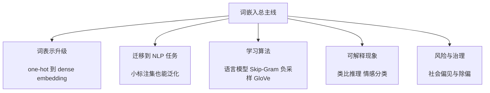

---
tags:
  - 理论
  - 深度学习
date: 2026-06-06
---
---

## 一、宏观主线

这一周的核心不是把词看成离散编号，而是把词放进一个可学习的连续空间里。这样做的直接收益是：模型能利用“语义相近”实现泛化，尤其适合标注数据少、无标签文本多的 NLP 任务。

  

更完整地看，这一章的主线是：`词表示升级 -> 嵌入如何使用 -> 嵌入怎样学出来 -> 嵌入能做什么 -> 嵌入还会带来什么风险`。

  

  

这张图用来定位整章结构，复习时先看它，再进入每个模块。

  

## 二、为什么需要词嵌入

  

### 2.1 one-hot 的根本缺陷

  

one-hot 的问题不在于它不能表示词，而在于它几乎不表达词与词之间的关系。它把每个词都当作彼此独立的离散 ID，因此模型很难把一个词上学到的规律迁移到相近词上。

  

- 若词汇表大小为 $V$，则 one-hot 向量维度就是 $V$。

- 若 `man` 是第 5391 个词，则可写为 $O_{5391}$。

- 任意两个不同 one-hot 向量几乎都正交，内积为 0。

- 所以模型无法从向量结构上知道 `apple` 和 `orange` 比 `king` 和 `orange` 更相近。

  

一个典型失败例子是：

  

- 已见过 `I want a glass of orange juice.`

- 未必能自然泛化到 `I want a glass of apple juice.`

  

因为在 one-hot 空间里，`orange` 与 `apple` 没有“相近”的几何关系。

  

### 2.2 词嵌入的核心思想

  

词嵌入用一个低维稠密向量表示单词，本质是在学“词的分布式特征”。这些特征不一定可直接命名，但它们会把语义或语法相近的词放在附近。

  

- 若嵌入维度是 $d=300$，则每个词对应一个 $300$ 维向量。

- 记词 $w$ 的嵌入为 $e_w$。

- 这些维度可以粗略理解为“潜在特征轴”，如 gender、royal、food、age 等，但真实训练出的轴往往不是这么干净。

  

词嵌入优于 one-hot 的关键，是它允许：

  

- 相近词拥有相近向量。

- 训练集中高频模式可以迁移到低频词。

- 下游模型以更紧凑的表示工作，而不是直接处理超高维稀疏向量。

  

### 2.3 嵌入空间的几何直觉与可视化

  

词嵌入最值得建立的是几何直觉：每个词是高维空间中的一个点，相近概念会聚成簇。可视化只是辅助理解，真正起作用的是原始高维结构。

  

- `man/woman/king/queen` 会彼此较近。

- 水果类如 `apple/orange` 会聚成一簇。

- 动物、数字、生物等也常形成语义簇。

- 常用可视化方法是 t-SNE，它把高维向量映到 2D 便于观察。

  

需要注意：

  

- t-SNE 只用于展示，不是训练词向量的方法。

- 可视化近不代表所有任务上都最优，但通常说明语义结构被学到了。

  

## 三、词嵌入如何用于 NLP

  

### 3.1 嵌入矩阵与查表机制

  

从实现角度看，学习词嵌入就是学习一个嵌入矩阵。单词并不是“算”出一个向量，而是“查”出矩阵中的某一列。

  

设词汇表大小为 $V$，嵌入维度为 $d$，则嵌入矩阵为：

  

$$

E \in \mathbb{R}^{d \times V}

$$

  

若第 $j$ 个词的 one-hot 向量为 $O_j$，则：

  

$$

e_j = EO_j

$$

  

这个公式的用途是说明“矩阵乘 one-hot 等价于取第 $j$ 列”。它的工程含义是：

  

- 数学上写成矩阵乘法方便推导。

- 工程上不会真的做稀疏大矩阵乘法。

- 实现时通常直接做 embedding lookup，即高效取列。

- Keras / PyTorch 中的 embedding layer 本质就是这个操作。

  

### 3.2 迁移学习为什么在词嵌入里有效

  

词嵌入最强的工程价值，是能把“大规模无标签文本”中学到的规律迁移到“小规模有标签任务”上。NLP 中大量成功案例都依赖这一点。

  

以命名实体识别为例：

  

- 训练集中见过 `Sally Johnson is an orange farmer.`

- 测试时可能出现 `Robert Lin is an apple farmer.`

- 甚至出现 `Robert Lin is a durian cultivator.`

  

若模型已有预训练嵌入，则可能知道：

  

- `orange / apple / durian` 都接近水果语义簇。

- `farmer / cultivator` 都接近职业语义簇。

- 因而更容易判断前面的名字是“人名”。

  

这类迁移成立的前提是：

  

- 先在超大无标签语料上学到 embedding。

- 再把 embedding 用到标注较少的下游任务。

- 下游任务数据越少，预训练嵌入通常越有价值。

  

### 3.3 典型使用流程与适用边界

  

词嵌入不是对所有 NLP 任务都同样有效，它最适合“下游标注少、语义泛化重要”的场景。课程里给出了标准三步走流程。

  

1. 在大语料上学习嵌入，或直接下载预训练词向量。

2. 在新任务中用嵌入替代 one-hot 作为输入表示。

3. 视数据量决定是否微调 embedding。

  

关于微调的经验判断：

  

- 若下游数据不大，通常不必专门费力微调 embedding。

- 若下游数据较大，微调可能进一步提升效果。

  

适用性上：

  

| 场景 | 词嵌入帮助大小 | 原因 |

|---|---|---|

| 命名实体识别、文本摘要、指代消解、文本解析 | 大 | 常有小标注集，需语义泛化 |

| 语言模型、机器翻译 | 相对较小 | 这些任务本身常有更大标注/训练规模 |

| 小数据 NLP 迁移学习 | 很大 | 预训练知识最能补数据缺口 |

  

### 3.4 与人脸编码的类比

  

词嵌入和人脸编码都在做“把对象映到向量空间”，但两者的输入机制不同。这个类比有助于理解 embedding，但不要把它们当成完全同一类算法。

  

- 相同点：都学到了低维连续表示，可用距离或方向表达相似性。

- 不同点：

  

| 对比项 | 词嵌入 | 人脸编码 |

|---|---|---|

| 对象集合 | 通常固定词汇表 | 潜在上无穷多张新脸 |

| 生成方式 | 为每个词学习一个固定向量 | 网络对任意新图像前向计算编码 |

| OOV 处理 | 常设 `<UNK>` | 通常不需要固定身份词表 |

  

## 四、词嵌入的结构性质

  

### 4.1 类比推理的向量规律

  

词嵌入最有名的性质，是某些语义/语法关系会表现为“近似平行的向量差”。这不是词嵌入唯一用途，但它说明 embedding 确实学到了稳定结构。

  

最经典例子是：

  

- `man : woman :: king : queen`

  

向量上可写为：

  

$$

e_{\text{man}} - e_{\text{woman}} \approx e_{\text{king}} - e_{\text{queen}}

$$

  

这条式子的直觉是：

  

- `man` 到 `woman` 的主要变化是 gender。

- `king` 到 `queen` 的主要变化也主要是 gender。

- 所以这两个差向量方向近似一致。

  

于是可通过如下思想做类比搜索：

  

$$

e_{\text{king}} - e_{?} \approx e_{\text{man}} - e_{\text{woman}}

$$

  

或等价地寻找最接近：

  

$$

e_{?} \approx e_{\text{king}} - e_{\text{man}} + e_{\text{woman}}

$$

  

算法角色上，这个式子不是训练目标，而是训练后对 embedding 结构的检验方法。

  

### 4.2 为什么坐标轴未必可解释

  

不要把每一维 embedding 都想成一个明确人类概念。训练算法通常只关心内积、相似度和预测效果，不保证每一维是“纯净语义轴”。

  

若存在可逆矩阵 $A$，则：

  

$$

(A\theta_i)^T(A^{-T}e_j)=\theta_i^Te_j

$$

  

这个公式说明：只要内积关系保持，坐标系可以被线性变换。它的直觉是：

  

- embedding 的“几何关系”比“单独某一维的含义”更稳定。

- 你可以旋转、拉伸、重参数化坐标轴，而很多预测关系不变。

- 因此某一维未必直接对应 gender / royal / food 这类人工可命名概念。

  

### 4.3 这一性质为什么仍然有用

  

即便单维不可解释，只要相对结构稳定，类比、聚类、最近邻检索等能力仍然成立。复习时应记住：词嵌入更像“结构表示”而不是“人工特征表”。

  

- 重点不是解释每一列数字。

- 重点是词间方向、距离、邻域和内积结构。

- 这也是后来很多表示学习方法的共同思想。

  

## 五、词嵌入是怎样学出来的

  

### 5.1 从语言模型出发学习 embedding

  

最早直观的方法，是先构造“根据上下文预测词”的监督学习任务，再让 embedding 作为这个任务中的可学习参数。语言模型不是唯一选择，但它很好地解释了 embedding 为什么会学出语义相近性。

  

典型做法：

  

- 输入固定长度历史窗口，如前 4 个词。

- 每个词先由 one-hot 经嵌入矩阵 $E$ 变成向量。

- 将这些 embedding 拼接后送入网络。

- 用 softmax 预测下一个词。

  

若每个嵌入是 300 维、窗口长度是 4，则输入主干网络的特征可看作 $4 \times 300=1200$ 维。

  

训练目标的隐含效果是：

  

- 若 `orange juice` 与 `apple juice` 都频繁出现，模型倾向让 `orange` 与 `apple` 的表示接近。

- 稀有词若出现在相近上下文，也会被拉向相似语义簇。

  

### 5.2 上下文定义可以变化

  

若目标只是学 embedding，而不是做最优语言模型，那么上下文不一定非得是“目标词前面的固定窗口”。课程里强调了这一点，因为后续简化算法都基于对上下文定义的放宽。

  

常见上下文选择包括：

  

- 目标词前若干词。

- 目标词左右若干词。

- 邻近的单个词。

- 在一定词距内随机采样的上下文词。

  

其中“邻近单词预测目标词/邻近词”这条路线，直接通向 **Word2Vec / Skip-Gram**。

  

### 5.3 Word2Vec：用更简单的问题学更好的表示

  

Word2Vec 的关键思想是：不一定要做一个很重的神经语言模型，只要设计一个足够好的代理任务，也能学到优秀 embedding。

  

在 **Skip-Gram** 中：

  

- 随机选一个上下文词 $c$。

- 再在其一定词距内随机选一个目标词 $t$。

- 学习从 $c$ 预测 $t$。

  

对应的 softmax 概率写作：

  

$$

p(t|c)=\frac{e^{\theta_t^Te_c}}{\sum_{j=1}^{V} e^{\theta_j^Te_c}}

$$

  

这个公式的用途是：给定上下文词 embedding $e_c$，为所有可能目标词分配概率。变量含义是：

  

- $e_c$：上下文词 embedding。

- $\theta_t$：目标词对应的 softmax 参数向量。

- $V$：词汇表大小。

  

损失函数通常是 one-hot 标签下的 softmax 交叉熵：

  

$$

L(\hat y,y)=-\sum_{i=1}^{V} y_i \log \hat y_i

$$

  

### 5.4 Skip-Gram 的瓶颈与层次 softmax

  

Skip-Gram 的核心问题不是思想不好，而是 softmax 过慢。因为每次都要对整个词汇表求和，词表大时成本极高。

  

- 若 $V=10{,}000$，已经不便宜。

- 若 $V=100{,}000$ 或 $1{,}000{,}000$，计算会更吃力。

  

层次 softmax（hierarchical softmax）用一棵分类树近似大 softmax：

  

- 每个内部节点是二分类器。

- 预测一个词，相当于在树上走一条路径。

- 复杂度从与 $V$ 线性相关，降到与 $\log V$ 相关。

- 常见词通常放树的上层，罕见词放深层，以减少平均检索成本。

  

### 5.5 训练样本采样不能太“按频率直觉”

  

不论是 Skip-Gram 还是后续负采样，语料中高频词过多都会污染训练效率。`the/of/a/and/to` 这类词如果被过度抽到，会让模型把太多更新浪费在停用词附近。

  

因此需要更平衡的采样策略，让模型有更多机会更新低频但语义重要的词，如 `durian`。

  

## 六、两类高效学习算法

  

### 6.1 负采样：把大 softmax 改造成若干二分类

  

负采样的核心不是“更精确”，而是“把训练目标改写成更便宜的二分类问题”。它通常是这一章最需要掌握的工程加速技巧。

  

构造样本方式：

  

- 正样本：真实上下文词-目标词对，如 `(orange, juice, 1)`。

- 负样本：固定上下文词，再随机抽若干无关词，如 `(orange, king, 0)`。

- 每个正样本配 $K$ 个负样本。

  

经验上：

  

- 小数据集：$K$ 常取 `5-20`。

- 大数据集：$K$ 常取 `2-5`。

  

学习目标变成逻辑回归：

  

$$

P(y=1|c,t)=\sigma(\theta_t^Te_c)

$$

  

这个公式的用途是判断一对词是否像“真实邻近词对”。它的工程意义是：

  

- 不再一次更新整个 $V$ 类 softmax。

- 每次只更新 `1 个正样本 + K 个负样本`。

- 所以单步计算量大幅下降。

  

### 6.2 负样本分布为什么取 $f(w)^{3/4}$

  

负样本如果完全按词频抽，会过度偏向高频词；若均匀抽，又不符合自然语言真实分布。Word2Vec 在两者之间取了一个经验上更有效的折中。

  

采样分布为：

  

$$

P(w_i)=\frac{f(w_i)^{3/4}}{\sum_{j=1}^{V} f(w_j)^{3/4}}

$$

  

直觉上：

  

- 它压低了超高频词的统治地位。

- 又保留了自然语言中“常见词更常见”的统计事实。

- 这是经验成功做法，不是本章强调的理论必然结论。

  

### 6.3 GloVe：直接拟合共现统计

  

GloVe 的风格和 Word2Vec 很不一样。它不从“在线构造代理监督问题”出发，而是显式统计词共现矩阵，再做加权回归。

  

设 $X_{ij}$ 表示词 $i$ 在词 $j$ 的上下文中出现的次数，则 GloVe 最小化：

  

$$

\min \sum_{i=1}^{V}\sum_{j=1}^{V} f(X_{ij})\left(\theta_i^Te_j+b_i+b'_j-\log X_{ij}\right)^2

$$

  

这个目标的作用是：让内积 $\theta_i^Te_j$ 加偏置后，去拟合词对共现频率的对数。这里：

  

- $X_{ij}$：词对共现计数。

- $f(X_{ij})$：权重函数，控制高频/低频词影响。

- $b_i,b'_j$：偏置项。

  

为什么要加 $f(X_{ij})$：

  

- 若 $X_{ij}=0$，则 $\log 0$ 无定义，需要规避。

- 过高频词若权重太大，会主导训练。

- 过低频词若权重太小，又学不到东西。

  

### 6.4 GloVe 与 Word2Vec 的关系

  

两者形式不同，但目的类似，都是让“经常出现在相似上下文中的词”得到相近表示。复习时要抓“统计视角差异”，而不是背谁绝对更强。

  

| 算法 | 核心出发点 | 训练对象 | 主要优点 | 主要难点 |

|---|---|---|---|---|

| 语言模型式 embedding | 预测下一个词 | 上下文到词 | 直观，便于理解 | 计算更重 |

| Word2Vec / Skip-Gram | 词对预测 | 邻近词对 | 简单高效，实用强 | softmax 原版昂贵 |

| 负采样 | 二分类近似 | 正负词对 | 极大降计算量 | 依赖采样策略 |

| GloVe | 共现矩阵回归 | 全局统计 | 公式简洁，利用全局信息 | 需处理权重与稀疏计数 |

  

## 七、词嵌入的典型下游应用

  

### 7.1 情感分类：先平均，再上分类器

  

词嵌入最容易落地的下游任务之一是情感分类。它特别适合小到中等规模标注集，因为 embedding 能补足“未见词/近义词”带来的泛化问题。

  

最简单模型：

  

1. 把句子中每个词变成 embedding。

2. 对所有 embedding 求和或求平均。

3. 送入 softmax 预测星级或情感标签。

  

这个方案的优点：

  

- 能处理任意长度输入。

- 参数少，训练简单。

- 小数据上常比 one-hot 基线强。

  

### 7.2 平均 embedding 模型的局限

  

平均法的问题是丢失词序。对于依赖否定、修饰、转折的句子，它很容易犯系统性错误。

  

典型失败句：

  

- `Completely lacking in good taste, good service and good ambiance.`

  

虽然句子里有多个 `good`，但整体是强负面。如果只平均 embedding，模型可能错误偏向正面。

  

### 7.3 用 RNN 做情感分类更合理

  

RNN 版本保留了序列顺序，因此更能理解 `not good`、`lacking in good taste` 这类组合语义。对情感任务来说，这往往是从“词袋近似”走向“序列建模”的关键一步。

  

流程是：

  

- 每个词先查 embedding。

- 按顺序送入 RNN。

- 取最后时刻隐藏状态做多对一分类。

- 输出情感标签或星级。

  

RNN 方案更强的原因：

  

- 能建模词序。

- 能理解否定和局部短语。

- 仍然享受预训练 embedding 带来的词汇泛化。

  

## 八、偏见与除偏

  

### 8.1 词嵌入为什么会带来社会偏见

  

词嵌入会忠实吸收训练语料中的统计规律，而人类文本本身可能带有性别、种族、年龄、性取向、社会经济地位等偏见。因此“学得好”不等于“学得公正”。

  

课程里的典型问题包括：

  

- `Man : Computer Programmer :: Woman : Homemaker`

- `Father : Doctor :: Mother : Nurse`

  

这类结果说明 embedding 不只是表达语言结构，也可能复制社会刻板印象。

  

### 8.2 三步除偏框架

  

本章介绍的是 Bolukbasi 等人的一套经典思路。它不是彻底解决方案，但提供了一个清晰、可操作的线性代数框架。

  

#### 8.2.1 识别偏见方向

  

先用成对词差估计“偏见轴”，如：

  

- $e_{\text{he}}-e_{\text{she}}$

- $e_{\text{male}}-e_{\text{female}}$

  

这些差向量可做平均，或更稳妥地用 SVD / PCA 提取主方向。对性别除偏来说，这条方向可近似视作 gender bias axis。

  

#### 8.2.2 中和（neutralize）

  

对本应中性的词，如 `doctor`、`babysitter`，把它们在偏见轴上的分量去掉。直觉上就是：

  

- 保留词的非性别语义部分。

- 消掉其在 gender 方向上的投影。

  

这样做的目标不是让所有词都“无性别”，而是让本不应带性别含义的职业、角色词变得更中立。

  

#### 8.2.3 均衡（equalize）

  

对本来就成对体现性别差异的词，如 `grandmother/grandfather`、`boy/girl`、`actor/actress`，希望它们除了性别维度外，对中性词的相似度保持平衡。

  

均衡想解决的问题是：

  

- 即使已对 `babysitter` 做 neutralize，

- 也可能仍有 `grandmother` 比 `grandfather` 更接近 `babysitter`。

  

所以 equalize 会把成对词重新调整到关于中性子空间对称的位置。

  

### 8.3 均衡算法的关键公式

  

若有一对需均衡的词 $w_1,w_2$，主要步骤如下：

  

$$

\mu = \frac{e_{w1}+e_{w2}}{2}

$$

  

这个均值向量的作用，是先找到词对的中心。

  

$$

\mu_{\perp}=\mu-\mu_B

$$

  

这里 $\mu_{\perp}$ 表示中心在无偏子空间中的分量，它决定了两词共同保留的“非性别语义中心”。

  

之后再分别构造两侧对称分量，并得到去偏后的：

  

$$

e_1=e_{w1B}+\mu_{\perp},\qquad e_2=e_{w2B}+\mu_{\perp}

$$

  

这些公式的直觉是：

  

- 先保留共同的非偏见部分。

- 再只让“应保留的性别差异”以对称方式存在。

- 这样它们到中性词的距离就更平衡。

  

### 8.4 这套方法的适用边界

  

除偏不是把所有与 gender 有关的信息删掉，而是区分“定义上应含有该属性”和“统计上被污染出的刻板相关性”。

  

- `grandmother / grandfather` 不应被简单做中和，因为性别是定义的一部分。

- `doctor / babysitter / receptionist` 更适合做中和或结合均衡处理。

- 论文里甚至训练分类器来区分哪些词“定义上带性别”，哪些不是。

  

课程结论很明确：这是重要但未彻底解决的研究方向。词嵌入除偏只是开始，真正的公平性问题远超一条 bias axis 能完全覆盖。

  

## 大标题建议

  

- `Lesson 5 Week 2：词嵌入、Word2Vec、GloVe 与除偏总笔记`

  

## 是否值得细读原文 / 原课

  

- 值得细读。原因是这章不只是概念综述，还包含多条容易混淆的算法链路：`语言模型式 embedding -> Skip-Gram -> 负采样 -> GloVe -> debiasing`。如果只背结论，很容易混掉“谁是在预测下一个词、谁是在做二分类、谁是在拟合共现矩阵、谁是在后处理 embedding”。